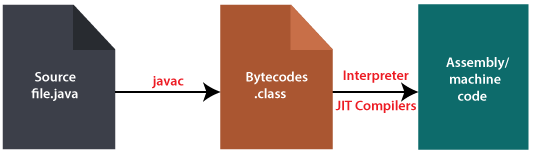

+++
title = 'JVM(JavaVirtualMachine) 파헤치기 (1)'
date = '2022-09-22T22:06:50+09:00'
description = "JVM의 동작 원리와 역할을 알아보고, Java 코드가 어떻게 실행되는지 바이트코드 컴파일 과정과 JIT 컴파일러의 동작 방식을 상세히 설명합니다."
summary = "Java Virtual Machine의 핵심 개념과 동작 원리를 파헤칩니다. 소스코드가 바이트코드로 변환되고 JIT 컴파일러를 통해 기계어로 실행되는 전체 과정을 이해해봅니다."
categories = ["Java", "Programming"]
tags = ["JVM", "Java"]
series = ["Deep Dive into JVM"]
series_order = 1

draft = false
+++

문득 Java라는 언어를 공부하면서 **JVM**에 대한 궁금증이 생겼다.
단순히 작성한 코드를 실행시켜주는 가상컴퓨터 이다 라고만 알고 있었기에
어떻게 동작을하고 하는 역할은 무엇인지 궁금해졌기에 파헤쳐보고자 한다.

## JVM이란?

**Java Virtual Machine**의 줄임말로 Java를 실행시키기 위한 가상컴퓨터 환경을 말한다.

### 그럼 JVM이 하는 역할의 무엇일까?

> Java는 OS에 종속적이지 않다.

위와 같은 조건을 충족 시키며 작성한 코드가 실행되기 위해선 Java와 OS사이에 무언가가 필요하다.

**그게 바로 JVM이다.**

---

## 코드 실행 과정

작성한 소스코드인(원시코드) `*.java` 를 CPU가 인식하기 위해선 **기계어**(010101000101...)로 변환이 이루어져야 한다.

### 그럼 *.java 가 바로 기계어로 변환되어 실행이 되는건가...?

아니다. `*.java` 파일은 우선 JVM이 인식을 할 수 있도록 **java bytecode**(`*.class`)로 변환이 이루어진다.

이 변환과정은 **java 컴파일러**에 의해 수행이 되어진다.


java 컴파일러는 JDK를 설치하면 bin폴더에 존재하는 `javac.exe` 이다.
- `javac` 명령어를 통해 `.class` 파일을 생성할 수 있고
- `java` 명령어를 통해 이 `.class`파일을 실행시킬 수 있다.

### 이제 OS에서 실행이 되는건가..?


아니다.... bytecode는 기계어가 아니므로 OS에서 바로 실행되지 않는다...!


이때 **JVM이 OS가 이 bytecode를 이해할 수 있도록 해석해주는 역할**을 한다.

이러한 JVM의 역할 덕분에 한 번 작성한 Java 코드가 OS에 상관 없이 실행이 될 수 있는 것이다.

### 전체 프로세스

`*.java` → `*.class` 인 bytecode 형태로 변환 → **JIT(Just In Time) 컴파일러**를 통해 기계어(binary code)로 변환

---

## JIT (Just In Time) 컴파일러란?

**JIT 컴파일** 또는 **동적번역(dynamic translation)**이라고 불린다.

JIT는 **인터프리터 방식의 단점을 보완**하기 위해 도입되었다.

프로그램이 실제 실행하는 시점에 기계어로 번역을 한다.

### 성능 특징


기계어는 캐시에 보관하기 때문에 **한 번 컴파일된 코드는 빠르게 수행**이 된다.


- JIT 컴파일러가 기계어로 컴파일 하는 과정은 바이트 코드를 인터프리팅하는 것보다 훨씬 **느리지만** 한 번 수행되면 그 이후로는 **빠르다**
- 그러나 한 번만 실행되는 코드라면 컴파일을 하지 않고 바로 인터프리팅하는 것이 유리하다

JIT 컴파일러를 사용하는 JVM은 해당 메서드가 얼마나 자주 수행되는지 체크를 하고 일정 정도를 넘을때에만 컴파일을 수행한다.

---

## 인터프리터 방식이란?

**인터프리터**는 실행 시마다 소스 코드를 한 줄씩 기계어로 번역하는 방식이기 떄문에 실행 속도는 정적 컴파일 언어보다 느리다.

### 대표적인 인터프리터 언어

- 파이썬 (Python)
- 자바스크립트 (JavaScript)
- 데이터베이스 언어인 SQL

### 장단점

| 구분 | 설명 |
|------|------|
| **장점** | 프로그램 수정이 간단하다 |
| **단점** | 실행 속도가 컴파일 언어보다 느리다 |


**컴파일러**는 소스코드를 번역해서 실행 파일을 만들기 때문에 프로그램에 수정 사항이 발생하면 소스 코드를 다시 컴파일해야 한다.

프로그램이 작고 간단하면 문제가 없지만 프로그램 덩치가 커지면 컴파일이 시간 단위가 되는 일이 많아진다.

하지만 **인터프리터**는 소스코드를 수정해서 실행시키면 끝이기에 수정이 빈번히 발생하는 용도의 프로그래밍에서 많이 사용된다.

