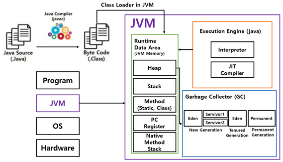
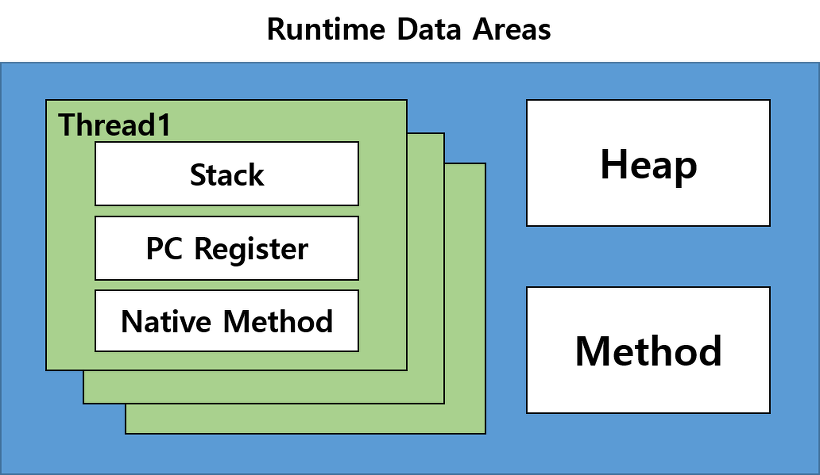

+++
title = 'JVM(JavaVirtualMachine) 파헤치기 (2)'
date = '2022-09-23T22:27:28+09:00'
description = "JVM의 핵심 구성요소인 Class Loader, Execution Engine, Garbage Collector, Runtime Data Areas를 상세히 살펴봅니다. 메모리 구조와 실행 과정을 이해합니다."
summary = "JVM의 4가지 핵심 구성요소와 Runtime Data Areas의 5가지 메모리 영역(Method, Heap, Stack, PC Register, Native Method Stack)을 깊이 있게 분석합니다."
categories = ["Java", "Programming"]
tags = ["JVM", "Java", "Class Loader", "Garbage Collector", "Memory Management", "Runtime Data Areas"]
series = ["Deep Dive into JVM"]
series_order = 2

draft = false
+++

# JVM의 구성요소

---

## 1. 클래스 로더 (Class Loader)

JVM의 **Class Loader**는 `javac`에 의해 변환된 바이트코드 파일인 `*.class` 파일을 **Runtime Data Areas**에 로딩하여 프로그램을 구동한다.


Class Loader의 로딩은 **런타임**에 일어나는데, 클래스에 처음 접근될 때 일어난다. 이를 통해 **Lazy Loading Singleton**이 구현되기도 한다.
- Class Loading 시간엔 **Thread-safe** 하다.


---

## 2. 실행 엔진 (Execution Engine)

Class Loader가 Runtime Data Areas에 불러온 **바이트 코드를 실행**한다. 바이트 코드를 기계어로 변경해 명령어 단위로 실행하는데, 1바이트의 OpCode와 피연산자로 구성이 된다.

### 주요 구성요소

- **인터프리터 (Interpreter)**
- **컴파일러 (Just-in-Time)**

---

## 3. 가비지 콜렉터 (Garbage Collector)

**Heap 영역에 참조되지 않는 오브젝트를 제거**하는 역할을 한다.

자바 이전에는 프로그래머가 모든 프로그램의 메모리를 관리했다. 자바에서는 JVM이 **가비지 컬렉션**이라는 프로세스를 통해 프로그램 메모리를 관리한다.


가비지 컬렉션은 자바 프로그램에서 사용되지 않는 메모리를 지속적으로 찾아내서 제거하는 역할을 한다.


---

## 4. 런타임 데이터 영역 (Runtime Data Areas)

**OS로부터 할당받은 JVM의 메모리 영역**이다. 자바 어플리케이션을 실행하는데 필요한 데이터를 담는다.

Runtime Data Areas는 아래와 같이 **5개의 영역**으로 나뉘어 진다.


**공유 영역**
- Method와 Heap 영역은 모든 Thread가 공유

**Thread별 영역**
- Stack, PC Register, Native Method 영역은 각 Thread 마다 존재


### (1) Method Area

JVM이 시작될 때 생성되고 JVM이 읽은 각각의 클래스와 인터페이스에 대한 런타임 상수 풀, 필드 및 메서드 코드, 정적 변수, 메서드의 바이트 코드 등을 보관한다.


Non-Heap 영역으로 Permanent 영역에 저장이된다. JVM 옵션 중 `PermSize`(Permanent Generation의 크기)를 지정할 때 고려해야 할 요소이다.


#### 1-1 Type Information

- Interface 여부
- 패키지 명을 포함한 Type 이름
- Type의 접근 제어자
- 연관된 Interface 리스트

#### 1-2 Runtime Constant Pool

- Type, Field, Method로의 모든 레퍼런스를 저장
- JVM은 Runtime Contant Pool을 통해 메모리 상 주소를 찾아 참조한다.

#### 1-3 Field Information

- Field의 타입
- Field의 접근 제어자

#### 1-4 Method Information

- Constructor를 포함한 모든 Method의 메타데이터를 저장
- Method의 이름, 파라미터 수와 타입, 리턴 타입, 접근 제어자, 바이트코드, 지역 변수 section의 크기 등을 저장

#### 1-5 Class Variable

- `static` 키워드로 선언된 변수를 저장
- 기본형이 아닌 static 변수의 실제 인스턴스는 Heap 메모리에 저장

### (2) Heap Area

`new` 연산자로 생성된 객체를 저장하는 공간이다.


참조하는 변수나 필드가 존재하지 않으면 **GC(Garbage Collector)**의 대상이 된다.


### (3) Stack Area

**Thread마다 별개의 Frame**으로 저장하며, 저장되는 요소는 아래와 같다.

#### 3-1 Local Variable Area

- 지역변수, 매개변수, 메소드를 호출한 주소 등 Method 수행 중 발생하는 임시데이터를 저장한다.
- 4바이트 단위로 저장되며, `int`, `float` 등 4바이트 기본형은 1개의 셀, `double` 등 8바이트의 기본형은 2개의 셀을 차지한다.
- `bool`은 일반적으로 1개의 셀을 차지한다.

#### 3-2 Operand Stack

- Method의 **workspace** 이다.
- 어떤 명령을 어떤 피연산자로 수행할 지 나타낸다.

#### 3-3 Frame Data

- Constant Pool Resolution, Method Return, Exception Dispatch 등을 포함한다.
- 참조된 Exception의 테이블도 가지고 있다.
- Exception이 발생하면 JVM은 이 테이블을 참고하여 어떻게 Exception을 처리할 지 정한다.

### (4) PC Register

Thread가 시작될 때 생성되며 생성될 때마다 생성되는 공간으로, **스레드마다 하나씩 존재**한다.

Thread가 어떤 부분을 어떤 명령으로 실행해야할 지에 대한 기록을 하는 부분으로 Thread가 **현재 실행하고 있는 부분의 주소**를 갖는다.


OS는 **PC(Program Counter) Register**를 참고하여 CPU 스케줄링 시 해당 Thread가 다음에 어떤 명령어를 수행해야 하는지 알 수 있다.


### (5) Native Method Stack

자바 프로그램이 컴파일되어 생성되는 바이트 코드가 아닌 **실제 실행할 수 있는 기계어로 작성된 프로그램을 실행시키는 영역**이다.

- **Java가 아닌 다른 언어로 작성된 코드**를 위한 공간이다.
- **Java Native Interface**를 통해 바이트 코드로 전환하여 저장하게 된다.
- 일반 프로그램처럼 커널이 스택을 잡아 독자적으로 프로그램을 실행시키는 영역이다.

---

## JVM 실행 순서

1. **메모리 할당**
   - 프로그램이 실행되면 JVM은 OS로부터 이 프로그램을 실행하는데 필요한 메모리를 할당받음
   - JVM은 이 메모리를 여러 영역으로 나누어 사용한다

2. **컴파일**
   - Java Compiler(`javac`)가 `*.java` 파일을 컴파일하여 `*.class` 인 자바 바이트코드로 변환시킨다

3. **클래스 로딩**
   - 컴파일된 `*.class` 파일들을 **Class Loader**를 통해 JVM 메모리 위에 로딩을 한다

4. **바이트코드 해석**
   - 로딩된 `*.class` 파일들은 **Execution Engine**을 통해 기계어로 해석된다

5. **실행 및 관리**
   - 해석된 바이트코드들은 메모리 영역에 배치되어 실질적인 수행을 하게 된다
   - 실행과정 속에서 JVM은 필요에 따라 **스레드 동기화**나 **가비지 컬렉터**와 같은 메모리 관리 작업을 수행한다