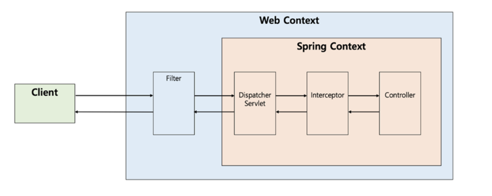

+++
title = 'Spring Dispatcher Servlet의 이해'
date = '2022-09-27T23:10:15+09:00'
description = "Spring MVC의 핵심 컴포넌트인 Dispatcher Servlet의 개념과 동작 방식을 상세히 알아봅니다"
summary = "Dispatcher Servlet이 클라이언트 요청을 받아 적절한 컨트롤러로 위임하는 Front Controller 패턴의 동작 원리와 전체 요청 처리 과정을 설명합니다"
categories = ["Spring"]
tags = ["Spring", "Spring MVC", "Dispatcher Servlet", "Servlet", "Web"]
series = ["Deep Dive into SpringBoot"]
series_order = 1

draft = false
+++

## Dispatcher Servlet이란?

디스패처 서블릿의 **dispatch**는 "보내다"라는 뜻을 가지고 있다. 이러한 단어의 뜻을 내포하는 디스패처 서블릿은 **HTTP 프로토콜로 들어오는 모든 요청을 가장 먼저 받아 적합한 컨트롤러에 위임해주는 프론트 컨트롤러(Front Controller)**라고 정의할 수 있다.

### 동작 개요

좀 더 자세한 절차는 다음과 같다:

1. 클라이언트로부터 어떠한 요청이 들어오면 **Tomcat**과 같은 서블릿 컨테이너가 요청을 받게 된다
2. 이 모든 요청을 프론트 컨트롤러인 **디스패처 서블릿**이 가장 먼저 받게 된다
3. 디스패처 서블릿은 공통적인 작업을 먼저 처리한 후에 해당 요청을 처리해야 하는 컨트롤러를 찾아서 작업을 위임한다

### Front Controller 패턴

여기서 **Front Controller**라는 용어는 주로 서블릿 컨테이너의 제일 앞에서 서버로 들어오는 클라이언트의 모든 요청을 받아서 처리해주는 컨트롤러로써, **MVC 구조에서 함께 사용되는 디자인 패턴**이다.

---

## Dispatcher Servlet의 동작 방식

디스패처 서블릿은 가장 먼저 요청을 받는 **Front-Controller**이다.
- **서블릿 컨텍스트(Web Context)**에서 필터들을 지나
- **스프링 컨텍스트(Spring Context)**에서 디스패처 서블릿이 가장 먼저 요청을 받게 된다

디스패처 서블릿은 적합한 컨트롤러와 메소드를 찾아 요청을 위임해야 하며 동작 방식은 아래와 같다.

### 상세 동작 과정

#### 1. HTTP Request가 Filter를 거쳐 Dispatcher Servlet이 받는다

#### 2. 요청 정보를 확인하고 위임할 Controller를 찾는다
`HandlerMapping`의 구현체 중 하나인 `RequestMappingHandlerMapping`은 `@Controller`로 작성된 모든 컨트롤러 빈을 파싱하여 **HashMap으로 (요청정보, 처리대상)을 관리**한다.

요청에 매핑되는 컨트롤러와 해당 메소드 등을 갖는 `HandlerMethod` 객체를 찾는다. 그렇기 때문에 `HandlerMapping`은 요청이 오면 HTTP Method, URI 등을 사용해 Key 객체인 요청 정보를 만들고, Value인 요청을 처리할 `HandlerMethod`를 찾아 `HandlerMethodExecutionChain`으로 감싸서 반환한다.

이렇게 감싸는 이유는 **컨트롤러로 요청을 넘겨주기 전에 처리해야 하는 인터셉터 등을 포함하기 위함**이다.

#### 3. Controller로 위임해줄 HandlerAdapter를 찾아 전달한다
디스패처 서블릿은 컨트롤러로 요청을 직접 위임하는 것이 아닌 `HandlerAdapter`를 통해 컨트롤러로 요청을 위임한다.

`HandlerAdapter` 인터페이스를 거치는 이유는 **컨트롤러를 구현하는 방식이 다양하기 때문**이다. `@Controller`에 `@RequestMapping` 관련 어노테이션을 사용해 컨트롤러 클래스를 주로 작성하지만, `Controller` 인터페이스를 구현하여 컨트롤러 클래스를 작성할 수도 있다.

그렇기 때문에 스프링은 `HandlerAdapter`라는 인터페이스를 통해 **어댑터 패턴을 적용**함으로써 컨트롤러의 구현 방식에 상관없이 요청을 Controller에 위임할 수 있는 것이다.

#### 4. HandlerAdapter가 Controller로 요청을 위임한다
`HandlerAdapter`가 Controller로 요청을 넘기기 전에 공통적인 전/후 처리 과정이 필요하다.

대표적으로:
- 인터셉터 처리
- 요청 시 `@RequestParam`, `@RequestBody` 등을 처리하기 위한 **ArgumentResolver**
- 응답 시 `ResponseEntity`의 Body를 JSON으로 직렬화하는 등의 처리를 하는 **ReturnValueHandler**

이러한 처리들이 어댑터에서 컨트롤러로 전달되기 전에 처리된다. 그리고 컨트롤러의 메소드를 호출하도록 요청을 위임한다.

#### 5. Business Logic을 처리한다
Controller는 서비스를 호출하고 비즈니스 로직을 진행한다.

#### 6. Controller가 반환값을 return한다
`ResponseEntity` 또는 View 이름을 반환한다.

#### 7. HandlerAdapter가 return값을 처리한다
`HandlerAdapter`는 컨트롤러로부터 받은 응답을 응답 처리기인 `ReturnValueHandler`가 후처리한 후에 디스패처 서블릿으로 돌려준다.

- 컨트롤러가 `ResponseEntity`를 반환하면 → `HttpEntityMethodProcessor`가 `MessageConverter`를 사용해 응답 객체를 직렬화하고 응답 상태(`HttpStatus`)를 설정
- View 이름을 반환하면 → `ViewResolver`를 통해 View를 반환

#### 8. 서버의 응답을 클라이언트에게 전달한다
`DispatcherServlet`을 통해 반환되는 응답은 다시 Filter를 거쳐 클라이언트에게 반환된다.

