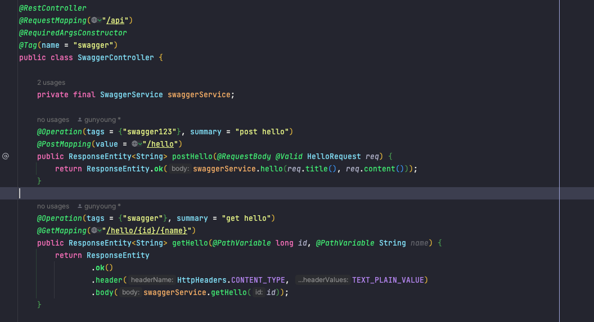
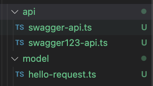

+++
title = 'Springdoc과 OpenAPI - ParameterObject와 어노테이션 활용법'
date = '2023-10-17T17:12:52+09:00'
description = "Spring Boot에서 Springdoc을 활용한 ParameterObject 처리와 Swagger2에서 Swagger3로의 어노테이션 마이그레이션 가이드"
summary = "Springdoc의 @ParameterObject 활용법과 Swagger 어노테이션 완벽 정리"
categories = ["Backend"]
tags = ["Spring", "Springdoc", "Swagger", "OpenAPI", "API Documentation"]
series = []
series_order = 1

draft = false
+++

## QueryString 처리 방식 비교

Spring에서 QueryString을 처리하는 두 가지 방식을 비교해보겠습니다.

### 방식 1: Object로 받기 (ParameterObject)

```java
@Operation(tags = {"swagger"})
@GetMapping("/hello/parameters1")
public ResponseEntity<List<ResponseTest>> parameterObjectTest(ParameterObjectReq req) {
    ResponseTest response = new ResponseTest(req.email(), req.password(), req.occupation());
    return ResponseEntity.ok(List.of(response));
}
```

### 방식 2: 개별 파라미터로 받기 (@RequestParam)

```java
@Operation(tags = {"swagger"})
@GetMapping("/hello/parameters2")
public ResponseEntity<List<ResponseTest>> parameterObjectTest2(
        @RequestParam(value = "email") String email,
        @RequestParam(value = "pw") String password,
        @RequestParam(value = "oq") OccupationStatus status
) {
    ResponseTest response = new ResponseTest(email, password, status);
    return ResponseEntity.ok(List.of(response));
}
```

### 모델 정의

**ParameterObjectReq (Request DTO)**

```java
public record ParameterObjectReq(
        String email,
        String password,
        OccupationStatus occupation
) {
}
```

**OccupationStatus (Enum)**

```java
public enum OccupationStatus {
    STUDENT,
    EMPLOYEE,
    UNEMPLOYED
}
```

### 두 방식의 차이점

일반적으로 request를 QueryString으로 받을 경우 `@RequestParam`을 사용하지만, 받는 인자가 많을 경우 첫 번째 방식처럼 QueryString을 Object 형태로 받을 수 있습니다.

#### @RequestParam vs ParameterObject

- **@RequestParam**: 기본적으로 `required = true`로 설정되어 있어 request value를 필수로 받습니다.
- **ParameterObject**: Spring에서 별도의 어노테이션 없이도 QueryString을 객체의 필드값에 자동으로 바인딩합니다. 하지만 `required`가 기본 설정되지 않아 `null` 값이 들어올 수 있습니다.

---

## Springdoc에서의 ParameterObject vs @RequestParam 변환 비교

### ParameterObject 사용 시


### @RequestParam 사용 시


---

## @ParameterObject 어노테이션 활용

ParameterObject를 Springdoc이 `@RequestParam`을 사용했을 때처럼 변환해주고 Required 여부를 표시하려면 다음과 같이 설정합니다.

### 코드 예제

```java
@ParameterObject
public record ParameterObjectReq(
        @NotNull
        String email,

        @NotNull
        String password,

        OccupationStatus occupation
) {
}
```

`@ParameterObject`는 Springdoc 어노테이션으로, 여러 개의 QueryString을 Object 형태로 받을 경우 해당 클래스 위에 명시하면 `@RequestParam`처럼 인식하고 변환해줍니다.


### JSR-303 지원

Springdoc은 JSR-303을 지원하며, 다음과 같은 validation 어노테이션을 사용할 수 있습니다

- `@NotNull`
- `@Min`, `@Max`
- `@Size`
- 기타 validation 어노테이션

**Springdoc 공식 문서에 따르면**

> This library supports
> - OpenAPI 3
> - Spring-boot (v1, v2 and v3)
> - JSR-303, specifically for @NotNull, @Min, @Max, and @Size
> - Swagger-ui
> - OAuth 2
> - GraalVM native images

### 변환 결과

ParameterObject도 `@RequestParam`으로 인식되도록 spec 파일이 작성되었고, `@NotNull`을 붙이지 않은 `occupation`에는 Required가 optional 형태로 표시됩니다.


**좌측 이미지**: `@ParameterObject`를 명시했을 경우 Springdoc이 인식하고 정상적인 spec으로 변환

---

## Swagger2 → Swagger3 Annotations

| Swagger2 | Swagger3 | 설명 |
| --- | --- | --- |
| @Api | @Tag | 클래스단에 swagger 리소스 표시(그룹화 시켜줌)<br><br>`name` : 태그의 이름<br>`description` : 태그에 대한 설명 |
| @ApiIgnore | @Parameter(hidden = true)<br>@Operation(hidden = true)<br>@Hidden | 해당 어노테이션을 통해 파라미터를 swagger-ui 에서 숨길 수 있음.<br><br>requestBody 나 ResponseBody 의 경우는<br>@JsonProperty(access = JsonProperty.Access.READ_ONLY) 를 사용 |
| @ApiImplicitParam | @Parameter | 단일 RequestParam 에 대한 설정 및 리소스 표시 |
| @ApiImplicitParams | @Parameters | 여러개의 RequestParam 을 설정 |
| @ApiModel | @Schema | `description` : 한글명<br>`defaultValue` : 기본값<br>`allowableValues` : 허용가능한 값(열거형으로 정의가능할 경우 설정합니다) |
| @ApiModelProperty(hidden = true) | @Schema(accessMode = READ_ONLY) |  |
| @ApiOperation(value = "foo", notes = "bar") | @Operation(summary = "foo", description = "bar") | `summary` : api에 대한 간략 설명<br>`description` : api에 대한 상세 설명<br>`responses` : api Response 리스트<br>`parameters` : api 파라미터 리스트 |
| @ApiParam | @Parameter | `name` : 파라미터 이름<br>`description` : 파라미터 설명<br>`in` : 파라미터 위치 (query, header, path, cookie) |
| @ApiResponse(code = 404, message = "foo") | @ApiResponse(responseCode = "404", description = "foo") | `responseCode` : http 상태코드<br>`description` : response에 대한 설명<br>`content` : Response payload 구조<br>`schema` : payload에서 이용하는 Schema<br><br>`hidden` : Schema 숨김여부<br>`implementation` : Schema 대상 클래스 |

- 여러 개의 request query params를 캡처하기 위해 객체를 사용하는 경우, 해당 메서드 인자에 `@ParameterObject` 어노테이션을 사용하세요
- 이 단계는 선택사항입니다: **여러 개의** `Docket` 빈이 있는 경우에만 `GroupedOpenApi` 빈으로 교체하세요

---

## @Tag 어노테이션 활용

`@Tag` 어노테이션을 사용하면 다음과 같은 그룹핑이 가능합니다

- Controller 단위로 그룹핑
- Controller 내부의 메서드 단위로 그룹핑
- `@Tag`에 명명한 이름에 따라 spec 파일로 전환 시 그룹핑 수행
- OpenAPI Generator를 이용한 client code 생성 시 해당 이름으로 파일 생성

### @Tag 중복 사용 시 주의사항

**질문**: 최상위 레벨에 `@Tag`로 그룹핑하고, 하위 메서드의 `@Operation`에서 다른 이름으로 tag를 설정하면 어떻게 될까요?

#### 테스트 결과



최상위에 `@Tag(name = "swagger")`를 설정하고, `postHello` 메서드의 `@Operation`에서 `tags = {"swagger123"}`을 추가한 경우, 같은 엔드포인트가 다른 그룹으로 중복 생성됩니다.

#### 문제점

이 상태에서 OpenAPI Generator를 사용하면 아래와 같이 중복된 client 코드가 생성되는 문제가 발생합니다.




**권장사항**: 특별한 경우가 아니라면 `@Tag`를 이용한 그룹핑은 Controller의 최상위에서만 사용하는 것을 권장합니다.

### OpenAPI Generator Client Code 생성 시 파일명

Client 코드 생성 시 `@Tag`에서 명명한 이름 + `-api`가 postfix로 붙습니다. 이 부분을 커스터마이징하려면 Mustache 파일을 수정해야 합니다.

### 참고 자료

- [Using Templates | OpenAPI Generator](https://openapi-generator.tech/docs/templating)
- [Mustache.js GitHub](https://github.com/janl/mustache.js)
- [OpenAPI Generator 사용법](https://hmos.dev/how-to-use-oas-generator)
- [OpenAPI Generator로 API의 안전한 Model과 정형화된 구현코드 자동생성하기](https://velog.io/@kdeun1/OpenAPI-Generator를-사용하여-API와-동일한-Model과-정형화된-API코드-자동생성하기)

---

## 인증 관련 OpenAPI 스펙

OpenAPI는 다양한 인증 방식을 지원합니다. 주요 설정 항목은 다음과 같습니다.

### type (인증 형식)

현재 API Key, HTTP, OAuth2, OpenID Connect 방식을 지원합니다.
**참고**: OpenAPI v2 스펙에서는 OpenID Connect 방식을 지원하지 않습니다.

**지원되는 타입**

- `http`: Basic, Bearer 및 기타 HTTP 인증 체계
- `apiKey`: API 키 및 쿠키 인증
- `oauth2`: OAuth2 인증
- `openIdConnect`: OpenID Connect 검색

### 주요 설정 항목

- **`name`**: 인증 키 이름 (API Key 방식 사용 시 필요)
- **`in`**: 인증 키의 위치 지정 (`query`, `header`, `cookie` 중 선택, API Key 방식 사용 시 필요)
- **`scheme`**: 인증 방식 지정 (`Basic` 또는 `Bearer`, HTTP 인증 방식 사용 시 필요)
- **`bearerFormat`**: Bearer 토큰 형식 (일반적으로 `JWT` 사용)
- **`flows`**: OAuth2 플로우 타입 (`implicit`, `password`, `clientCredentials`, `authorizationCode` 중 선택)
- **`openIdConnectUrl`**: OpenID Connect URL (OpenAPI v2 스펙에서는 OAuth2나 Bearer 토큰 방식으로 대체 권장)

---

## @Deprecated 전략

API 버전 업데이트로 DTO 스펙에 변경이 있을 경우, 다음과 같은 단계적 전략을 사용합니다.

### 1단계: @Deprecated 표시

먼저 변경될 필드에 `@Deprecated` 어노테이션을 붙입니다.

```java
public class UserDto {
    @Deprecated
    private String oldField;
    
    private String newField;
}
```

OpenAPI spec 상에도 해당 스키마의 필드에 `deprecated`가 표시되고, 프론트엔드에서 코드 생성 시 해당 필드에 deprecated 표시가 나타납니다. 이를 통해 프론트엔드 팀에게 곧 해당 필드가 제거될 것임을 미리 알립니다.

### 2단계: @Schema(hidden = true) 적용

프론트엔드에서 새로운 스펙으로 마이그레이션이 완료되면, 서버에서 해당 `@Deprecated` 필드에 `@Schema(hidden = true)`를 추가하여 더 이상 OpenAPI spec에 해당 필드가 생성되지 않도록 합니다.

```java
public class UserDto {
    @Deprecated
    @Schema(hidden = true)
    private String oldField;  // spec에서 제외됨
    
    private String newField;
}
```

### 3단계: 필드 제거

충분한 시간이 지난 후 해당 필드를 완전히 제거합니다.

이러한 단계적 접근 방식을 통해 프론트엔드와 백엔드 간의 안전한 API 버전 관리가 가능합니다.
