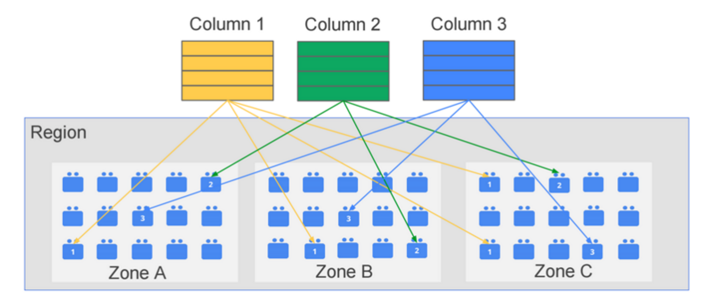

+++
title = 'BigQuery란?'
date = '2023-12-18T21:37:29+09:00'
description = "Google BigQuery의 특징과 아키텍처"
summary = "컬럼 기반 데이터베이스인 BigQuery의 주요 특징과 Colossus 기반 분산 처리 구조"
categories = ["Backend", "Database"]
tags = ["BigQuery", "Google Cloud", "OLAP", "Column Database", "Distributed System"]
series = ["BigQuery"]
series_order = 1

draft = false
+++

## BigQuery 특징

### Column-based Database

일반적인 로우 단위로 저장이 되는 RDB와 다르게 특정 컬럼의 데이터를 접근할 때 해당 로우를 모두 스캔하지 않고 찾고자 하는 컬럼 파일 하나만 스캔하여 접근.

특정 컬럼만을 읽어 개수를 세거나 통계를 내는 분석용 데이터베이스(OLAP) 작업에 유리.

**장점**
- 컬럼 단위 스캔으로 빠른 조회
- 분석 쿼리에 최적화
- 스토리지 효율성

---

### 데이터 처리 구조

**Colossus (분산 스토리지)**
- Google File System(GFS)를 잇는 Google의 클러스터 수준의 파일시스템
- 맨 아래에서 저장소를 제공하고 Jupiter라는 TB급 네트워크 망을 통해 컴퓨터 노드와 통신

**연산 계층 (Leaf, Mixer1, Mixer0)**
- 디스크 없이 Colossus에서 읽은 데이터를 처리
- 각각 위의 계층으로 데이터를 올리는 역할
- 분산 병렬 처리를 통한 고속 연산

---

### No Key, No Index

키와 인덱스 개념이 존재하지 않음. 풀스캔 only

**특징**
- 인덱스 관리 불필요
- 컬럼 기반 스캔으로 성능 확보
- 대용량 데이터 분석에 최적화

---

### No Update, Delete

성능을 위해 추가만 가능하며 한번 입력된 데이터는 수정되거나 삭제될 수 없음.

데이터가 잘못 입력된 경우 테이블을 삭제하고 다시 만들어야 함.

**제약사항**
- INSERT만 지원
- UPDATE/DELETE 미지원
- 데이터 수정 시 재생성 필요

---

### Eventual Consistency

데이터를 3개의 데이터 센터에 복제를 하기에 데이터 쓰기 후 바로 조회가 안 될 수 있음.

**특징**
- 3중 복제를 통한 고가용성
- 최종 일관성 보장
- 쓰기 후 즉시 읽기 불가능할 수 있음

---

## 참고 자료

- [BigQuery 성능/비용 팁](https://burning-dba.tistory.com/137)
- [BigQuery UNNEST, ARRAY, STRUCT 사용 방법](https://zzsza.github.io/gcp/2020/04/12/bigquery-unnest-array-struct/#bigquery-unnest)
- [구글 빅데이터 플랫폼 빅쿼리 아키텍처 소개](https://bcho.tistory.com/1117)
