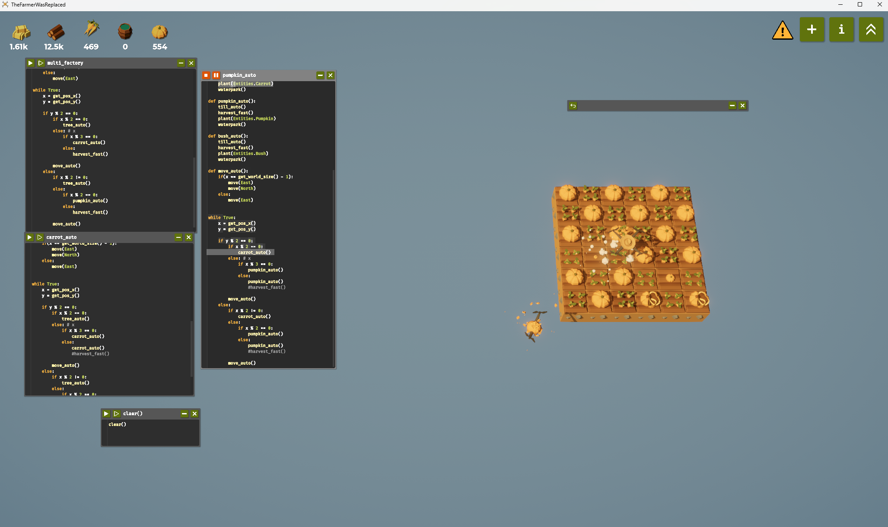

+++
title = '코딩게임 추천 : 농부는 대체되었다'
date = '2025-12-15T16:26:41+09:00'
description = "파이썬으로 드론을 제어해 농작물 재배를 자동화하는 독특한 코딩 게임 소개"
summary = "개발자를 위한 스팀 게임 추천글....?"
categories = ["Game"]
tags = ["코딩게임", "파이썬", "자동화", "스팀", "농부는대체되었다"]
series = []
series_order = 1

draft = false
+++

스팀 게임에서 재미난 게임을 발견해서 소개를 해보고자 한다. 😂

**농부는 대체되었다** 라는 게임인데 기본적으로 드론이 있고 이 드론을 파이썬 코드를 작성해서 제어하고 농작물 재배를 자동화 하는 게임이다. ㅋㅋㅋㅋㅋ 😂

생각보다 파이썬 문법에 대한 설명도 잘 되어 있고 파이썬을 처음 써보시는 분들도 재미있게 공부하면서 연습하기에 나쁘지 않을 수 도 있을 것 같다 ?

아직 한글 모드를 적용안해서 영어로 나오지만 한글 모드도 지원하는 것 같다..!

게임을 해보면서 처음에 변수도 선언이 안되어서 뭐지 싶었는데 함수, 변수 등 모두 작물을 재배한 재화로 스킬을 찍어야 사용할 수 있는 그런 게임이다...

나름 중독성 있고 최종적으로 재배지를 늘리고 농작물을 심고 자라나는 속도에 맞추어 수확하는 최적화 움직임을 알고리즘으로 구현 하는 컨텐츠 인 것 같다.

---

오늘 기준으로 스팀에서 할인도 20% 하고 있으니 관심 있는 분들(개발자 ?)은 한번쯤 해보시는 걸 추천....? 😄

**스팀 링크**: [농부는 대체되었다](https://store.steampowered.com/app/2060160/_/)

