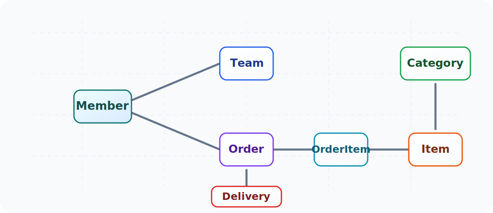
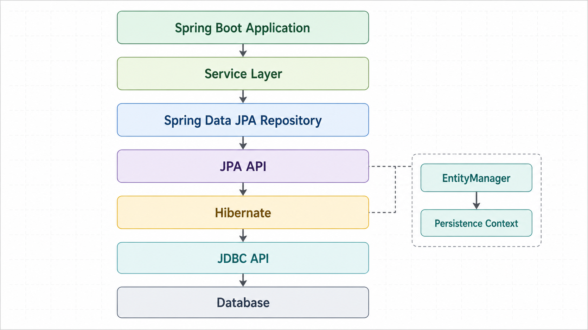

+++
title = 'Summary of JPA Programming Chapter 1'
date = '2026-05-06T22:27:39+09:00'
description = "A summary of the limits of JDBC and SQL-centric development, the paradigm mismatch between objects and relational databases, and how JPA and Spring Data JPA help reduce that gap."
summary = "A practical overview of why JPA is used, including SQL-centric development pain points, object-relational mismatch, and identity comparison."
categories = ["JPA", "Spring"]
tags = ["JPA", "Spring Data JPA", "Hibernate", "ORM", "Java"]
series = ["JPA Programming"]
series_order = 1

draft = false
+++

In the past, database access code was often written directly with the JDBC API or through SQL Mapper tools such as iBatis, modern MyBatis, or Spring's `JdbcTemplate`. These tools reduced some of the burden of handling the JDBC API itself, but CRUD SQL still had to be written repeatedly.

JPA is the standard ORM specification in the Java ecosystem that helps reduce that repetition and makes it easier to design applications around objects. Hibernate is the most widely used implementation, and in Spring applications, Spring Data JPA makes JPA more convenient to use.

In this post, I want to summarize why JPA appeared in the first place by looking at the problems of SQL-centric development, the paradigm mismatch between objects and relational databases, and where JPA sits inside a Spring application.

---

## Problems with Writing SQL Directly

Even if a DAO successfully hides the JDBC API, the core problems of SQL-centric development still remain. Because application entities and database tables are tightly coupled, even a small change to an entity can force changes across DAO code and a large amount of SQL.

For example, if a new field is added to the member table, you may have to update the select SQL, insert SQL, update SQL, and result mapping code together. Even when data access has been separated into its own layer, the real development flow is still dragged around by SQL.

This approach can be summarized into three major problems:

1. It is hard to achieve true layer separation.
2. It is hard to trust entities.
3. It is hard to avoid SQL-dependent development.

The second point is especially important. Depending on which SQL query was used, the scope of related objects inside the entity can change. In other words, developers are not really working with objects. They are constantly forced to remember which SQL was used to load them.

---

## The Paradigm Mismatch Between Objects and Relational Databases

If an object only contains simple values, storing it in a file or a database is not especially difficult. But real objects reference other objects, have inheritance structures, and rely on polymorphism.

Suppose `Member` references `Team`. If you save only the member object, you may lose the team information it was pointing to. But storing and loading the entire object graph every time is not realistic either.

Java supports serialization and deserialization, which make it possible to save objects to files and restore them later. But serialized objects are difficult to search and partially query. So in practice, we end up using relational databases, and that is where the problem begins.

Objects are modeled around references, abstraction, inheritance, and polymorphism. Relational databases structure data around tables, rows, columns, and foreign keys. Their goals and representation styles are different. This is what people mean by the paradigm mismatch between objects and relational databases.

---

## Limits of Object Graph Navigation

Based on the example from the book, assume we have relationships like the following:



When you work directly with SQL, the very first SQL query determines how far you can safely navigate the object graph. If the SQL only loaded `Member`, you cannot immediately trust and use `Team` or `Order`. The developer has to know whether those related objects were joined and loaded as part of the query.

Of course, loading every object related to `Member` into application memory every time would also be unrealistic. In the end, you often create multiple query methods depending on how much data is needed.

For example:

```java
findMember(memberId);
findMemberWithTeam(memberId);
findMemberWithOrders(memberId);
findMemberWithOrdersAndDelivery(memberId);
```

As these query methods multiply, service logic becomes more dependent on SQL fetch scope than on the object model itself. Even if you want to write object-oriented code, in practice you are limited to whatever range the SQL happened to load.

JPA helps reduce this problem by allowing related objects to be loaded at the moment they are actually used. This is called lazy loading.

```java
Member member = jpa.find(Member.class, memberId);

Order order = member.getOrder();
order.getOrderDate(); // SELECT SQL runs when Order is actually accessed
```

In short, JPA makes it possible to separate object graph navigation from the exact timing of database queries to some degree.

---

## Identity vs Equality Comparison

Relational databases distinguish rows by primary key values. Java objects, however, have two different comparison concepts.

1. Identity comparison uses `==` to compare object references.
2. Equality comparison uses `equals()` to compare values.

What happens if you load the same member twice through the JDBC API?

```java
public Member getMember(String memberId) {
    String sql = "SELECT * FROM MEMBER WHERE MEMBER_ID = ?";
    // JDBC API, execute SQL
    return new Member(...);
}

String memberId = "1";
Member member1 = memberDAO.getMember(memberId);
Member member2 = memberDAO.getMember(memberId);

member1 == member2; // false
```

Even though both objects came from the same database row, they are still different Java object instances. So identity comparison returns `false`.

JPA guarantees that if the same entity is loaded within the same transaction, it returns the same object instance.

```java
String memberId = "1";
Member member1 = jpa.find(Member.class, memberId);
Member member2 = jpa.find(Member.class, memberId);

member1 == member2; // true
```

This is possible because JPA manages entities through the persistence context. If an entity with the same identity is already being managed in the current transaction, JPA can reuse the existing object instead of loading it again from the database.

---

## Where Does JPA Sit in a Spring Application?

When you use JPA in a Spring application, the overall flow usually involves Spring Data JPA, the JPA API, Hibernate, and the JDBC API working together in layers.



If we simplify the structure, it looks like this:

1. The application service layer uses repositories.
2. Spring Data JPA repositories generate repetitive CRUD implementations for you.
3. Inside the repository layer, the JPA API is used.
4. Hibernate commonly acts as the JPA implementation.
5. Hibernate communicates with the actual database through the JDBC API.

The important point is that JPA itself is not an implementation. It is a standard specification. You can think of it as a set of interfaces and rules. Hibernate is the ORM framework that implements the JPA specification. Spring Data JPA is the technology that provides repository abstractions to make JPA more convenient.

So it is important not to confuse the roles of Spring Data JPA, JPA, and Hibernate.

```text
Spring Data JPA: Repository abstraction and repetitive code reduction
JPA: Standard Java ORM specification
Hibernate: JPA implementation
JDBC API: Low-level API for communicating with the database
Database: The actual data store
```

When studying JPA, it is usually better to first understand the problems the standard is trying to solve, and then learn the concrete features that Hibernate provides on top of that.

---

## What Is JPA?

JPA stands for Java Persistence API. It is the standard ORM technology in the Java ecosystem. It sits between the application and the JDBC API and maps objects to relational databases.

ORM stands for Object-Relational Mapping. It means mapping objects and relational databases to one another. With an ORM framework, instead of directly writing `INSERT SQL` every time you store an object, you can work with objects almost as if you were storing them in a Java collection. The ORM framework then generates the appropriate SQL and saves the data to the database.

Because JPA is only an API specification, it cannot run by itself. You need an ORM framework that implements JPA. Common implementations include Hibernate, EclipseLink, and DataNucleus, with Hibernate being the most widely used.

The JPA standard is a collection of general and common ORM capabilities. So it makes sense to first understand the core concepts of JPA, and then learn additional Hibernate-specific features as needed.

The evolution of JPA versions looks like this:

| Version | Year | Main Changes |
|------|------|-----------|
| JPA 1.0 | 2006 | Initial version. Composite keys and relationship features were limited |
| JPA 2.0 | 2009 | Included most core ORM features and added Criteria |
| JPA 2.1 | 2013 | Added stored procedure access, converters, and entity graphs |

---

## Why Use JPA?

### Productivity

With JPA, you do not need to repeatedly write SQL and JDBC API code every time you store an object. You pass the object to JPA, and JPA generates and executes the appropriate SQL.

JPA also provides features such as automatic DDL generation for statements like `CREATE TABLE`. This helps shift the development flow from database-first design toward object-first design.

### Maintainability

When you work directly with SQL, changing an entity field can force you to update a large amount of related SQL and JDBC mapping code. With JPA, the repetitive burden of maintaining basic CRUD SQL can be greatly reduced.

Of course, using JPA does not mean you can ignore database design or query optimization. But it does remove much of the repetitive work involved in simple CRUD and object mapping.

### Performance

Suppose you load the same member twice within the same transaction. With plain JDBC, the same `SELECT` SQL may be executed twice. JPA, on the other hand, can keep the first result in the persistence context and reuse the managed entity on the second lookup.

Hibernate also provides features such as SQL hints, lazy loading, write-behind, and dirty checking. Depending on the situation, these features can help with performance optimization.

### Data Access Abstraction and Vendor Independence

Relational databases often differ in syntax and behavior even for similar features. If you write too much database-specific SQL, moving to another database becomes difficult.

JPA provides an abstracted data access layer between the application and the database. If the database changes, many parts of the application can remain intact as long as JPA is configured with the proper dialect.

---

## Wrap-up

JPA is not just a tool for reducing SQL writing. It is an ORM standard designed to reduce the paradigm mismatch between objects and relational databases and help applications preserve a more natural object model.

In Spring, Spring Data JPA reduces the burden of repository implementation, the JPA API acts as the standard interface, Hibernate works as the actual ORM implementation, and JDBC is still used underneath to talk to the database.

To really understand JPA, it helps to start with a simple question: why did SQL-centric development feel uncomfortable in the first place? Once that becomes clear, features such as lazy loading, the persistence context, identity guarantees, and dirty checking make much more sense.
