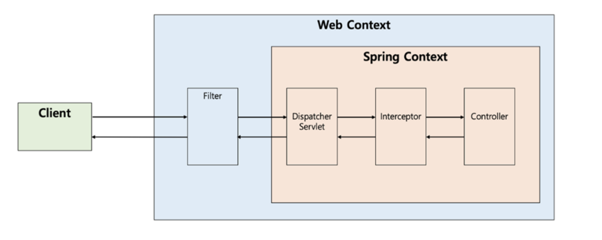
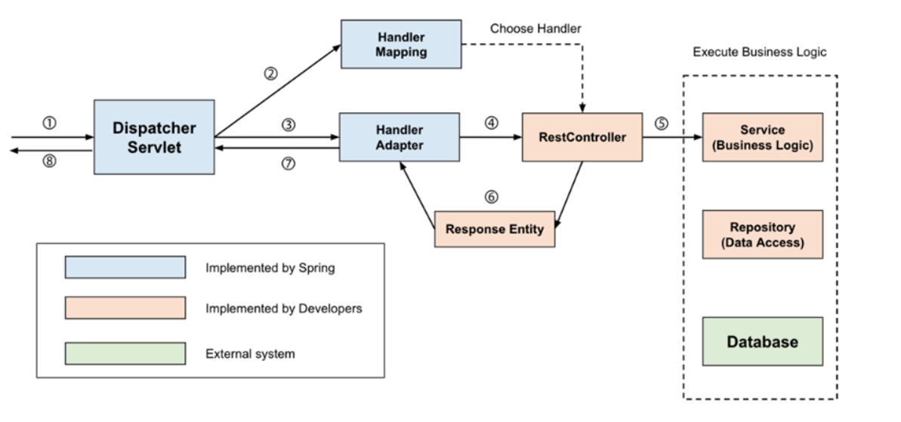

+++
title = 'Understanding Spring Dispatcher Servlet'
date = '2022-09-27T23:10:15+09:00'
description = "Learn about the core component of Spring MVC, Dispatcher Servlet, and how it works in detail"
summary = "Explains the Front Controller pattern and the complete request processing flow of how Dispatcher Servlet receives client requests and delegates them to appropriate controllers"
categories = ["Spring"]
tags = ["Spring", "Spring MVC", "Dispatcher Servlet", "Servlet", "Web"]
series = []
series_order = 1

draft = false
+++

## What is Dispatcher Servlet?

The term **dispatch** in Dispatcher Servlet means "to send". The Dispatcher Servlet can be defined as a **Front Controller that receives all incoming HTTP protocol requests first and delegates them to the appropriate controller**.

### Operation Overview

The more detailed process is as follows:

1. When a request comes from the client, a servlet container such as **Tomcat** receives the request
2. All these requests are received first by the **Dispatcher Servlet**, which is the Front Controller
3. The Dispatcher Servlet processes common tasks first and then finds the controller that should handle the request and delegates the work

### Front Controller Pattern

The term **Front Controller** refers to a controller that receives and processes all client requests coming to the server at the front of the servlet container, and it is a **design pattern used together with the MVC architecture**.

---

## How Dispatcher Servlet Works

The Dispatcher Servlet is the **Front-Controller** that receives requests first.
- It passes through filters in the **Servlet Context (Web Context)**
- The Dispatcher Servlet receives the request first in the **Spring Context**

The Dispatcher Servlet must find the appropriate controller and method to delegate the request, and the operation process is as follows.

### Detailed Operation Process

#### 1. HTTP Request passes through Filter and is received by Dispatcher Servlet

#### 2. Check request information and find the Controller to delegate
`RequestMappingHandlerMapping`, one of the implementations of `HandlerMapping`, parses all controller beans written with `@Controller` and **manages (request information, processing target) as a HashMap**.

It finds the `HandlerMethod` object that contains the controller and method mapped to the request. Therefore, when a request comes in, `HandlerMapping` creates a Key object (request information) using HTTP Method, URI, etc., finds the `HandlerMethod` to process the request as Value, wraps it in `HandlerMethodExecutionChain`, and returns it.

The reason for this wrapping is to **include interceptors that need to be processed before passing the request to the controller**.

#### 3. Find and pass the HandlerAdapter to delegate to the Controller
The Dispatcher Servlet does not delegate requests directly to the controller, but delegates them through `HandlerAdapter`.

The reason for going through the `HandlerAdapter` interface is that **there are various ways to implement controllers**. While controller classes are mainly written using `@Controller` with `@RequestMapping` related annotations, controller classes can also be written by implementing the `Controller` interface.

Therefore, Spring applies the **adapter pattern** through the `HandlerAdapter` interface, allowing requests to be delegated to Controllers regardless of the controller implementation method.

#### 4. HandlerAdapter delegates the request to the Controller
Common pre/post processing is required before `HandlerAdapter` passes the request to the Controller.

Typically:
- Interceptor processing
- **ArgumentResolver** to handle `@RequestParam`, `@RequestBody`, etc. in requests
- **ReturnValueHandler** that handles processing such as serializing the Body of `ResponseEntity` to JSON in responses

These processes are handled before being passed from the adapter to the controller. Then it delegates the request to invoke the controller's method.

#### 5. Process Business Logic
The Controller calls the service and proceeds with business logic.

#### 6. Controller returns the return value
Returns `ResponseEntity` or View name.

#### 7. HandlerAdapter processes the return value
`HandlerAdapter` returns the response received from the controller to the Dispatcher Servlet after post-processing by the `ReturnValueHandler`, the response processor.

- If the controller returns `ResponseEntity` → `HttpEntityMethodProcessor` uses `MessageConverter` to serialize the response object and set the response status (`HttpStatus`)
- If View name is returned → View is returned through `ViewResolver`

#### 8. Send the server's response to the client
The response returned through `DispatcherServlet` passes through the Filter again and is returned to the client.
