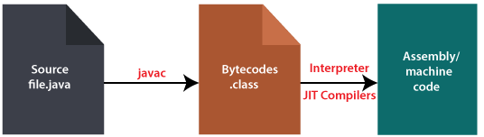

+++
title = 'Deep Dive into JVM (Java Virtual Machine) (1)'
date = '2022-09-22T22:06:50+09:00'
description = "Explore how JVM works and its role in Java execution. Learn about the bytecode compilation process and how the JIT compiler operates in detail."
summary = "A deep dive into the core concepts and operating principles of the Java Virtual Machine. Understand the complete process of how source code is converted to bytecode and executed as machine code through the JIT compiler."
categories = ["Java", "Programming"]
tags = ["JVM", "Java"]
series = ["Deep Dive into JVM"]
series_order = 1

draft = false
+++

While studying the Java language, I became curious about the **JVM**.
I only knew it as a virtual computer that executes the code I write,
so I wanted to dig deeper into how it works and what role it plays.

## What is JVM?

An abbreviation for **Java Virtual Machine**, it refers to a virtual computer environment for running Java.

### So what role does JVM play?

> Java is not OS-dependent.

To meet this condition and execute the code we write, something is needed between Java and the OS.

**That's the JVM.**

---

## Code Execution Process

Source code (raw code) `*.java` must be converted to **machine code** (010101000101...) for the CPU to recognize it.

### So does *.java get directly converted to machine code and executed...?

No. The `*.java` file is first converted to **java bytecode** (`*.class`) so that the JVM can recognize it.

This conversion process is performed by the **java compiler**.


The java compiler is `javac.exe` located in the bin folder when you install JDK.
- You can generate `.class` files using the `javac` command
- You can execute these `.class` files using the `java` command


### So now it runs on the OS..?


No.... bytecode is not machine code, so it doesn't run directly on the OS...!


At this point, **the JVM plays the role of interpreting this bytecode so the OS can understand it**.

Thanks to this role of the JVM, Java code written once can be executed regardless of the OS.

### Overall Process

`*.java` → converted to bytecode form `*.class` → converted to machine code (binary code) through **JIT (Just In Time) compiler**

---

## What is JIT (Just In Time) Compiler?

Also called **JIT compilation** or **dynamic translation**.

JIT was introduced to **complement the shortcomings of the interpreter approach**.

It translates to machine code at the actual execution time of the program.

### Performance Characteristics


Since machine code is stored in cache, **code that has been compiled once executes quickly**.


- The process of JIT compiler compiling to machine code is much **slower** than interpreting bytecode, but once executed, it's **fast** afterwards
- However, for code that runs only once, it's advantageous to interpret directly without compiling

JVM using JIT compiler checks how often a method is executed and only compiles when it exceeds a certain threshold.

---

## What is the Interpreter Approach?

An **interpreter** translates source code line by line to machine code at each execution, so execution speed is slower than statically compiled languages.

### Representative Interpreter Languages

- Python
- JavaScript
- Database language SQL

### Advantages and Disadvantages

| Category | Description |
|------|------|
| **Advantages** | Simple program modification |
| **Disadvantages** | Execution speed is slower than compiled languages |


**Compilers** translate source code to create executable files, so when program modifications occur, the source code must be recompiled.

If the program is small and simple, there's no problem, but as the program grows larger, compilation often takes hours.

However, with an **interpreter**, you just modify the source code and run it, so it's widely used in programming where modifications occur frequently.

